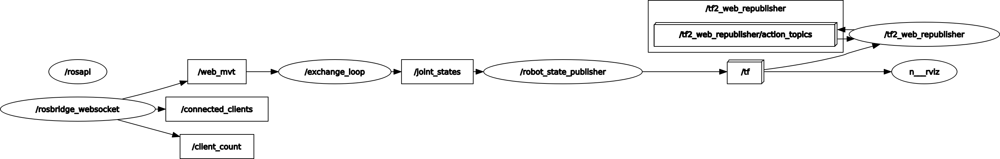

# Présentation

Projet bras robot 6 axes avec ROS Noetic

# Etat actuel
Graphique des différents liens :



# Installations nécessaire

Sur une distribution linux ubuntu 20.04 installer ROS Noetic en suivant ce [tuto](http://wiki.ros.org/noetic/Installation/Ubuntu)

## Packets suplémentaires

[rosbridge suite](http://wiki.ros.org/rosbridge_suite)

```bash
sudo apt-get install ros-noetic-rosbridge-suite
```

Pour l'affichage du 3D sur l'interface web dans votre workspace clonner le git [tf2_web_republisher](http://wiki.ros.org/tf2_web_republisher) :
```bash
git clone https://github.com/RobotWebTools/tf2_web_republisher
```

### [Tinymovr](https://tinymovr.readthedocs.io/en/latest/) 
Pour l'installation de [Tinymovr](https://tinymovr.readthedocs.io/en/latest/) :
```bash
pip install tinymovr==0.3.12
echo 'export PATH="/home/barek/.local/bin/:$PATH"'>> ~/.bashrc
source ~/.bashrc
```

Pour l'utilisation de Tinymovr studion :
```bash
tinymovr
```
dans le cas de l'erreur suivante :
```bash
can.exceptions.CanInitializationError: [Errno 13] could not open port /dev/ttyACM0: [Errno 13] Permission denied: '/dev/ttyACM0'
```
deux possibilitées :
```bash
sudo chmod 666 /dev/ttyACM0 
```
ou 
```bash
sudo adduser $USER root
```
# Utilisation
## initialisation
Une fois le repos git cloner effectuer une commande catkin_make dans Arm-Robot-ROS/
```bash
:~/Documents/Arm-Robot-ROS$ catkin_make
```
N'oublier pas de sourcer votre package ROS  :
```bash
:~/Documents/Arm-Robot-ROS$ source devel/setup.bash
#ou
echo "source /home/<USER>/Documents/Arm-Robot-ROS/devel/setup.bash">>~/.bashr
```


Lancement de Rviz avec visualisation du 3D du robot :
```bash
roslaunch my_robot_description launcher.launch model:='$(find my_robot_description)/urdf/little_fat.urdf'
```
Lancement des curseurs pour pilotages des axes :
```bash
rosrun joint_state_publisher_gui joint_state_publisher_gui
```

Lancement de l'interface Web :
```bash
python3 -m http.server 7000
roslaunch robot_gui_bridge websocket.launch 
```
Lancement du script de conversion pour pilotage du robot avec interface web :

```bash
rosrun my_robot_description exchange_loop.py 
```


# Installations optionnelles

## [PlotJuggler](https://github.com/facontidavide/PlotJuggler)
outils d'affichage sous forme de courbe des topics ROS 
### Installation
```bash
sudo apt install ros-${ROS_DISTRO}-plotjuggler-ros
```
### Utilisation
```bash
rosrun plotjuggler plotjuggler
```
## [GitKraken](https://www.gitkraken.com/)

Outil grafique pour l'utilisation de GitHub
### installation
```bash
sudo snap install gitkraken --classic
```
### [Tuto utilisation git kraken](https://www.gitkraken.com/learn/git/tutorials)